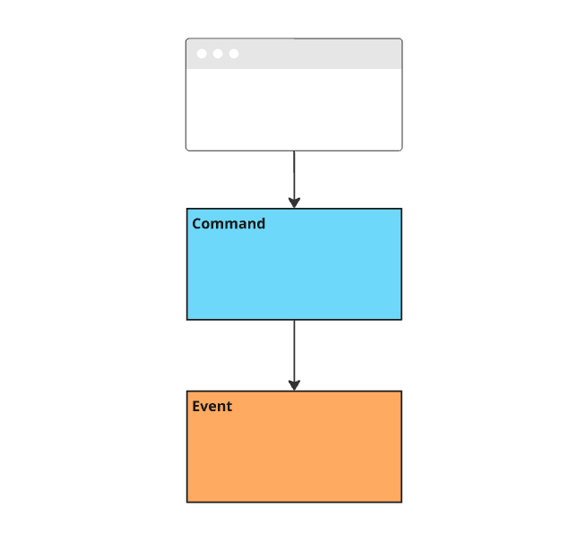
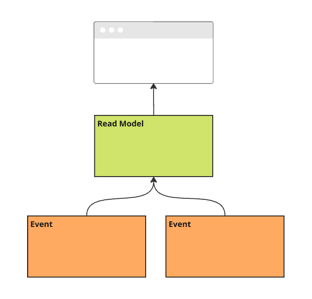
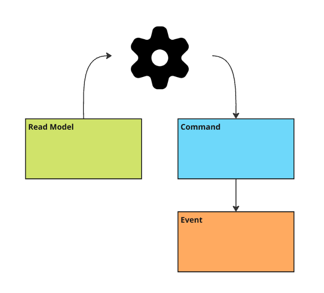
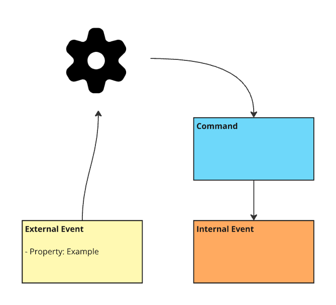

# 🧪 Specific instructions for Vertical Slices

## Technical Stack

- .NET 9
- React
- Prime React
- Cratis Application Model
- Cratis Chronicle with ApplicationModel setup for CQRS and Event Sourcing
- MongoDB for read models

## General

- Always write specs for the behavior added.
- Build to get proxy objects generated for frontend.
- Abide by all the guidelines and consider this document an override for anything that contradicts the general guidelines.
- When you're adding a new slice to an existing feature that has other slices, leverage the MCP server `vertical-slices-dev`
  to get information about existing vertical slices and their structure, to be able to consume events from other slices.
- Drop the `.Features` part of the namespace when working within the `Features` folder. (e.g. `Library.Authors.Registration` instead of `Library.Features.Authors.Registration`)
- Keep data integrity high, protect inputs, validate commands, and enforce business rules - we don't want to produce erroneous events.

## CQRS

- System separates commands and queries.
- Commands change the state of the system.
- Queries read the state of the system.
- Commands and queries are handled by different slices.
- Commands and queries are not mixed in the same slice.

## Slices

There are only 4 types of vertical slices. Each type has a specific purpose and should be used accordingly.

### State Change



- State Changes are used to change the state of the system.
- A significant state change is represented as an event.
- State Changes are triggered by a command.
- A command can fail, for instance by validation or business rules.
- A command produces one or more events representing the state change.

### State View



- State Views represents read models of the system.
- Events from other slices are used to project the state into a read model.
- Read Models can have one or more queries to retrieve the data.
- Queries should be simple and not contain any business logic.
- Queries can have parameters to filter the data.

### Automation



- Automations are used to automate tasks in the system.
- Automations use state represented as read models to make decisions.
- Read Models are local and not shared between slices.
- Typically passive ad-hoc read models are used.

### Translation



- Translations are used to translate events from one slice to another.
- Translations can be used to integrate with external systems.
- Translations trigger commands in its own slice and produce new events.
- Translations can be used to decouple slices from each other.
- Translations can be used to adapt events from other slices to the local domain.

## Structure

- Within the Features folder we add Features, within this folder we add vertical slices.
- Each slice has a specific type (State Change, State View, Automation, Translation).
- Each slice has its own folder.
- Stay away from postfixing the slice folder with the type of slice it is. The folder name should represent the domain concept or its purpose. (e.g. Registration, Listing, Removal, Notification)
- Within each slice folder we have:
  - A single C# file with all the backend artifacts for the slice - name the file the same as the folder.
  - Any frontend React components (.tsx files) that belong to this slice.
  - Any slice-specific specs in `when_*` folders.
- If the slice grows too big, we can split it into multiple files, but try to keep related functionality together within the slice folder.
- Frontend code should live in the same slice folder as the backend code it interacts with, not at the feature root level.

**Example folder structure:**
```
Features/
├── Authors/
│   ├── Authors.tsx                    // Feature composition page
│   ├── Registration/
│   │   ├── Registration.cs            // Backend slice file
│   │   ├── AddAuthor.tsx              // Frontend component for this slice
│   │   └── when_registering/          // Specs for this slice
│   │       ├── and_name_is_unique.cs
│   │       └── and_name_already_exists.cs
│   └── Listing/
│       ├── Listing.cs                 // Backend slice file
│       └── Listing.tsx                // Frontend component for this slice
```

## Concepts

- We prefer using value types that implements the `ConceptAs<T>` type from `Cratis.Concepts` namespace.
- Concepts that are shared between slices should be placed in the feature folder.
- Concepts that are specific to a slice should be placed in the slice folder.
- Concepts that are shared between features should be placed in the `Features` folder.
- Prefer one file per concept type, as that makes it easier to find and possible move them.

## Commands

- Commands are represented as `record` types.
- Commands are immutable and should use positional parameters.
- Commands should be prefixed with the `[Command]` attribute from `Cratis.Applications.Commands.ModelBound` namespace.
- Commands should have a single method `Handle` that returns the side effects of the command.
    - A Single event instance
    - A collection of event instances - represented as `IEnumerable<T>`.
    - A tuple with event instances and a result for the caller to use (e.g., an id). Tuple can be have single events or collections of events.
    - OneOf<,> can be used to represent different outcomes of the command.
        - Example is `Result<,>` which can have a ValidationResult as the first generic argument and a tuple or single event or collection of events as the second generic argument (Found in `Cratis.Monads` namespace).
- Events are appended to the event log based on a convention for what the `EventSourceId`is
    - If the command has a parameter marked with the `[Key]`attribute from `Cratis.Chronicle.Keys` namespace, this is used as the `EventSourceId`.
    - If the command has a parameter with a type that implements `EventSourceId` from `Cratis.Chronicle.Events` namespace, this is used as the `EventSourceId`.
    - If the command implements the `ICanProvideEventSourceId` interface from `Cratis.Chronicle.Applications.Commands` namespace, the `EventSourceId` property is used as the `EventSourceId`.

Example:

```csharp
[Command]
public record AddBookTitleToInventory(BookTitle Title, ISBN ISBN, AuthorId AuthorId, int Count)
{
    public BookAddedToInventory Handle() => new(Title, AuthorId, Count);
}
```

## Command Input Validation

- Input validation should be done using concepts that encapsulate the validation logic.
- Use the `CommandValidator<T>` class from `Cratis.Applications.Commands` namespace to validate commands.

Example:

```csharp
[Command]
public record AddItemToCart(
    string Sku,
    int Quantity)
{
    public void Handle()
    {
        // Handle the command
    }
}


public class AddItemToCartValidators : CommandValidator<AddItemToCart>
{
    public AddItemToCartValidators()
    {
        RuleFor(c => c.Sku).NotEmpty().WithMessage("You have to provide a Sku");
    }
}
```


## Business Rules

- If the command needs to validate from projected values that can be represented in a read model that an instance is resolved by the same `EventSourceId` as the command
  we can use the `CommandValidator<T>` and create a specific read model for the purpose of validation and a projection that projects the events to the read model.
- If the command needs to validate disregarding the `EventSourceId` it has to use the `RuleFor<T>` class from `Cratis.Chronicle.Rules` namespace to validate the command.

Example of using `RuleFor<T>`:

```csharp
[Command]
public record AddItemToCart([Key] CartId CartId, Sku Sku, Price Price);

public class AddItemToCartRules : RulesFor<AddItemToCartRules, AddItemToCart>
{
    public AddItemToCartRules()
    {
        RuleForState(m => m.NumberOfItems)
            .LessThan(3)
            .WithMessage("You can only add 3 items to the cart");
    }

    public int NumberOfItems { get; set; }

    public override void DefineState(IProjectionBuilderFor<AddItemToCartRules> builder) => builder
        .From<ItemAddedToCart>(_ => _.Count(m => m.NumberOfItems));
}
```

## Constraints

- Constraints can be used to enforce uniqueness.
- There are 2 types of constraints:
    - Unique value per event source - ensures that a value is unique for a given event source. It needs to include all event types that can produce the value, and event types that can remove the value.
    - Unique event type - ensures that an event type is only produced once for a given `EventSourceId`.
- On<>() methods are used to specify a property on an event and it does not handle complex expressions.

Example for unique property based on multiple event types:

```csharp
public class UniqueAuthorName : IConstraint
{
    public void Define(IConstraintBuilder builder) => builder
        .Unique(_ => _
            .On<AuthorRegistered>(e => e.FirstName, e => e.LastName)
            .On<AuthorNameChanged>(e => e.FirstName, e => e.LastName)
            .RemovedWith<AuthorRemoved>()
            .WithMessage("Author name must be unique"));
}
```

Event sources can be constrained to only have a single event of a given type per `EventSourceId`, below is an example of constraining a user to only have a single `UserRegistered` event:

```csharp
public class UserConstraints : IConstraint
{
    public void Define(IConstraintBuilder builder)
    {
        builder.Unique<UserRegistered>();
    }
}
```

## Events

- Events are represented as `record` types.
- Events are immutable and should use positional parameters.
- Events should be prefixed with the `[EventType]` attribute from `Cratis.Events` namespace.

Example:

```csharp
[EventType]
public record BookAddedToInventory(BookTitle Title, AuthorId Author, int Count);
```

## Read Models

- Read Models are represented as `record` types.
- Read Models are immutable and should use positional parameters.
- Read Models should be prefixed with the `[ReadModel]` attribute from `Cratis.Applications.Queries.ModelBound` namespace.
- Read Models are produced by projecting events from other slices.
- More details about all the capabilities of projections can be found in the [Cratis documentation](https://www.cratis.io/docs/Chronicle/recipes/projections).

Example:

```csharp
[ReadModel]
public record Author(AuthorId Id, AuthorName Name)
{
    public static ISubject<IEnumerable<Author>> AllAuthors(IMongoCollection<Author> collection) =>
        collection.Observe();
}

public class AuthorProjection : IProjectionFor<Author>
{
    public void Define(IProjectionBuilderFor<Author> builder) => builder
        .AutoMap()
        .From<AuthorRegistered>();
}
```

## Queries

- Queries are built directly into the read model type as static methods.
- Queries can either return a single instance or a collection of instances (IEnumerable<T>) or they can be reactive and return an ISubject<T>.
- Favor using reactive queries (ISubject<T>) as they are more flexible and can be used to build more complex queries.
- Paging and sorting should not be built into the query, the platform handles this.
- Queries can have parameters to filter the data.
- Name the query method to represent what it does - e.g. `ById`, `All`, `ByStatus`, etc. And make the name something is descriptive what what it represents as well, e.g. `AllAuthors`, `AuthorsByStatus`, etc.

```csharp
[ReadModel]
public record Author(AuthorId Id, AuthorName Name)
{
    public static ISubject<IEnumerable<Author>> AllAuthors(IMongoCollection<Author> collection) =>
        collection.Observe();
}
```

## Reactors

- Reactors are used to react to events from other slices and typically used in a Translation slice.
- Reactors are represented as `class` types inheriting from `IReactor`.
- Methods on it follow a specific signature and are discovered by convention. (public Task <EventTypeName>(<EventTypeName> evt, EventContext context))
- Reactors can trigger commands in its own slice that produce new events.

Example:

```csharp
public class StockKeeping(IStockKeeper stockKeeper, ICommandPipeline commandPipeline) : IReactor
{
    public async Task BookReserved(BookReserved @event, EventContext context) =>
        await commandPipeline.Execute(new DecreaseStock(@event.Isbn, await stockKeeper.GetStock(@event.Isbn)));
}

[Command]
public record DecreaseStock(ISBN Isbn, BookStock stockBeforeDecrease)
{
    public StockDecreased Handle() => new(Isbn, stockBeforeDecrease);
}

[EventType]
public record StockDecreased(ISBN Isbn, BookStock StockBeforeDecrease);
```


## Specs

- Follow the general guidelines for writing specs as described in the [specifications instructions](./specifications.instructions.md).
- We do not need any `for_` folders and can skip straight to the `when_` folders.
- Specs should be placed in the slice folder that contains the command being tested.
- Specs should specify the behavior of the command and not the implementation details.
- Specs are in general integration specs and are written slightly differently than other specs.

Example of an integration spec:

```csharp
using Cratis.Applications.Commands;
using Cratis.Chronicle.Events;
using Cratis.Chronicle.XUnit.Integration.Events;
using context = Library.Authors.Registration.when_registering.and_there_already_exists_one_with_same_name.context;

namespace Library.Authors.Registration.when_registering;

[Collection(ChronicleCollection.Name)]
public class and_there_already_exists_one_with_same_name(context context) : Given<context>(context)
{
    public class context(ChronicleOutOfProcessFixture fixture) : given.an_http_client(fixture)
    {
        public const string AuthorName = "John Doe";
        public CommandResult<Guid> Result;

        Task Establish() => EventStore.EventLog.Append(AuthorId.New(), new AuthorRegistered(AuthorName));

        async Task Because()
        {
            Result = await Client.ExecuteCommand<RegisterAuthor, Guid>("/api/authors/register", new RegisterAuthor(AuthorName));
        }
    }

    [Fact] void should_not_be_successful() => Context.Result.IsSuccess.ShouldBeFalse();

    [Fact] void should_have_appended_only_one_event() => Context.ShouldHaveTailSequenceNumber(EventSequenceNumber.First);
}
```

> Note: The context is aliased for simplification in use, and actual context class is nested within the spec class.

## Frontend

- Frontend is built using React and TypeScript.
- PrimeReact is used as the UI component library.
- Each feature has its own folder within the `Features` folder.
- Each feature has its own composition page that composes the different slices of the feature together.
- **Frontend components (.tsx files) should be placed in the same slice folder as their corresponding backend code.**
- Each slice folder contains both the C# backend file and any React components that belong to that slice.
- Use the `Components` folder for shared components that can be used across features and slices.
- Use the `Layout` folder for layout components that are used to compose the overall layout of the application.
- Frontend sits together with the backend for high cohesion within each slice.

### Commands

- Commands are represented as TypeScript types and are automatically generated from the C# commands using the Cratis ProxyGenerator tool when building the C# code (`dotnet build`).
- On every command that gets generated, there is a `.use()` method that can be used to get a React hook to use the command in a React component.
- Commands are executed by calling `.execute()` on the command instance returned by `.use()`.
- Commands return a `CommandResult` that holds information if it was successful or not and any result returned from the command.

### Queries

- Commands are represented as TypeScript types and are automatically generated from the C# read models using the Cratis ProxyGenerator tool when building the C# code (`dotnet build`).
- On every query that gets generated, there is a `.use()` method that can be used to get a React hook to use the query in a React component.
- Queries can be paged, if necessary, then you should use the `.useWithPaging(pageSize: number)` method on the query.

### Dialogs

- Dialogs are used to show a modal dialog to the user.
- Within the dialogs, you can use commands directly and execute them when the user submits the dialog.


Example of a dialog that sits inside a slice folder called `Registration` (in the same folder as the `Registration.cs` file):

```tsx
import { Button } from 'primereact/button';
import { Dialog } from 'primereact/dialog';
import { DialogResult, useDialogContext } from '@cratis/applications.react/dialogs';
import { InputText } from 'primereact/inputtext';
import { RegisterAuthor } from './Registration'; // Import from the same slice folder
import { useState } from 'react';

export const AddAuthor = () => {
    const [name, setName] = useState<string>('');
    const { closeDialog } = useDialogContext();
    const [registerAuthor] = RegisterAuthor.use();

    const handleAdd = async () => {
        registerAuthor.name = name;
        await registerAuthor.execute();
        closeDialog(DialogResult.Ok);
    };

    return (
        <Dialog header="Register author" visible={true} style={{ width: '50vw' }} onHide={() => closeDialog(DialogResult.Cancelled)}>
            <div className="card flex flex-column md:flex-row gap-3">
                <div className="p-inputgroup flex-1">
                    <span className="p-inputgroup-addon">
                        <i className="pi pi-user"></i>
                    </span>
                    <InputText placeholder="Name" value={name} onChange={e => setName(e.target.value)} />
                </div>
            </div>

            <div className="card flex flex-wrap justify-content-center gap-3 mt-8">
                <Button label="Add" icon="pi pi-check" onClick={handleAdd} autoFocus />
                <Button label="Cancel" icon="pi pi-times" severity='secondary' onClick={() => closeDialog(DialogResult.Cancelled)} />
            </div>
        </Dialog>
    );
};
```

### Listing Views

- A listing view is used to show a list of items to the user.
- Use the `DataTable` component from PrimeReact to show the list.
- Use the query with paging to get the data for the list.

```tsx
import { DataTable } from 'primereact/datatable';
import { Column } from 'primereact/column';
import { AllAuthors } from './AllAuthors';

const pageSize = 5;

export const Listing = () => {
    const [allAuthorsResult, , setPage] = AllAuthors.useWithPaging(pageSize);

    return (
        <DataTable
            lazy
            paginator
            value={allAuthorsResult.data}
            rows={pageSize}
            totalRecords={allAuthorsResult.paging.totalItems}
            alwaysShowPaginator={false}
            first={allAuthorsResult.paging.page * pageSize}
            onPage={(e) => setPage(e.page ?? 0)}
            scrollable
            scrollHeight={'flex'}
            emptyMessage="No authors found.">
            <Column field="name" header="Name" />
        </DataTable>
    );
}
```

### Composition

- At the root of features, add a composition page. Its responsibility is to compose the different slices of the feature together.
- The composition page imports React components from the individual slice folders within the feature.
- Use the `<Page/>` components from `Components` - it has a menu bar that can hold actions.
- Leverage the `<Menubar/>` configuration for the `Page` component to add actions to the page.

```tsx
import { Menubar } from 'primereact/menubar'
import { MenuItem } from 'primereact/menuitem';
import * as mdIcons from 'react-icons/md';
import { AddAuthor } from './Registration/AddAuthor'; // Import from slice folder
import { Listing } from './Listing/Listing'; // Import from slice folder
import { DialogResult, useDialog } from '@cratis/applications.react/dialogs';
import { Page } from '../../Components/Common';

export const Authors = () => {
    const [AddAuthorDialog, showAddAuthorDialog] = useDialog(AddAuthor);

    const menuItems: MenuItem[] = [
        {
            label: 'Add Author',
            icon: mdIcons.MdPersonAdd,
            command: async () => {
                await showAddAuthorDialog();
            }
        }
    ];

    return (
        <Page title="Authors">
            <Menubar model={menuItems} />
            <Listing /> {/* This component comes from the Listing slice folder */}

            <AddAuthorDialog />
        </Page>
    );
};
```

### Routing

- Use the `IMenuItemGroup` type from `Layout` to define the menu items for the application that shows in the sidebar.
- Maintain the top level routing for menu items in the `App.tsx` file.
- Each feature should add its own routing within its own composition page, if needed.

The `IMenuItemGroup` import:

```tsx
import { IMenuItemGroup } from './Layout/Default/Sidebar/MenuItem/MenuItem';
```

Example of how to define menu items.

```tsx
    const menuItems: IMenuItemGroup[] = [
        {
            items: [
                {
                    label: 'Authors',
                    url: '/authors',
                    icon: mdIcons.MdOutlinePeople,
                },
                {
                    label: 'Inventory',
                    url: '/inventory',
                    icon: mdIcons.MdOutlinePeople,
                }
            ]
        }
    ];
```

Example of routing:

```tsx
<LayoutProvider>
    <DialogComponents confirmation={ConfirmationDialog} busyIndicator={BusyIndicatorDialog}>
        <BrowserRouter>
            <Routes>
                <Route element={<DefaultLayout menu={menuItems} />}>
                    <Route path='/' element={<Home />} />
                    <Route path='/authors' element={<Authors />} />
                    <Route path='/inventory' element={<Inventory />} />
                </Route>
            </Routes>
        </BrowserRouter>
    </DialogComponents>
</LayoutProvider>
```
