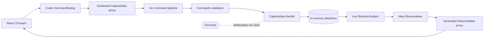

<!--
Copyright (c) Cratis. All rights reserved.
Licensed under the MIT license. See LICENSE file in the project root for full license information.
-->

# Idea Loom — Arc + React, without Chronicle

> A small, polished full-stack slice that shows what **Cratis Arc** gives you before event sourcing enters the picture: model-bound CQRS, validation, generated TypeScript contracts, live queries, React 19, Arc React MVVM, and Cratis Components.

Idea Loom captures short improvement ideas on a live board. The command writes directly to an in-memory current-state store. The query observes that store and pushes every change to React. There are **no events, projections, event logs, or Chronicle packages** in this sample—deliberately.

## What you will see

- A focused `CaptureIdea` model-bound command with no controller or handler class
- `IdeaId`, `IdeaTitle`, and `IdeaSummary` as Fundamentals `ConceptAs<T>` values
- Concept validators shared by the backend pipeline and generated frontend validation
- A model-bound `Idea` read model with the live `ObserveIdeas` query
- TypeScript command, query, and read-model contracts generated by a Debug build
- React 19 with Arc React, a small MVVM search interaction, and a Cratis `CommandDialog`
- A restrained specification set around the current-state write and view-model behavior

## The slice at a glance



The write path stores current state directly. Arc still owns the command/query boundary and full-stack contract. If the domain later needs history, replay, or facts for other consumers, Chronicle can replace the write path without changing the React query contract.

## Prerequisites

Requires .NET 10, Node.js 23 or newer, and the repository-pinned Yarn 4.5.3. Install the frontend dependencies once from the Samples root:

```bash
corepack enable
yarn install
```

## Run it

All commands below start at the **Samples repository root**.

### 1. Build the backend and generate contracts

```bash
dotnet build Arc/React/Arc.React.csproj -c Debug
```

A Debug build writes the generated contracts beside the C# slice:

- `Ideas/Board/CaptureIdea.ts`
- `Ideas/Board/Idea.ts`
- `Ideas/Board/ObserveIdeas.ts`
- `Ideas/Board/index.ts`

Never edit those files. Change the C# model and run the Debug build again.

### 2. Start the backend

```bash
dotnet run --project Arc/React/Arc.React.csproj --no-build
```

Arc listens on `http://localhost:5064`.

### 3. Start React

In a second terminal:

```bash
yarn vite --config Arc/React/.frontend/vite.config.ts
```

Open `http://localhost:5173`, capture an idea, and watch the observable query update the board without a manual refresh. Open a second browser tab to see both clients update together.

> The store is intentionally in memory. Restarting the backend clears the board.

## Build and verify

```bash
# Regenerate TypeScript contracts and build the backend
dotnet build Arc/React/Arc.React.csproj -c Debug

# Verify the release build without touching generated contracts
dotnet build Arc/React/Arc.React.csproj -c Release -p:CratisProxiesOutputPath=

# Run the focused backend specifications
dotnet test Arc/React/Arc.React.Specs/Arc.React.Specs.csproj -c Debug

# Type-check, lint, specify, and bundle React
yarn tsc -b Arc/React/.frontend/tsconfig.json
yarn eslint --config Arc/React/eslint.config.mjs Arc/React
yarn vitest run --config Arc/React/.frontend/vite.config.ts
yarn vite build --config Arc/React/.frontend/vite.config.ts
```

To serve the production frontend from ASP.NET Core after those builds:

```bash
dotnet run --project Arc/React/Arc.React.csproj -c Release --no-build
```

Then open `http://localhost:5064`.

## Code tour

| Path | Why it matters |
| --- | --- |
| `Program.cs` | Adds standalone Arc, registers the current-state store, serves the built React app, and contains no Chronicle wiring. |
| `Ideas/Board/IdeaId.cs` | Shows a non-event-source identifier as a strongly typed `ConceptAs<Guid>`. |
| `Ideas/Board/IdeaTitle.cs` | Carries the title and its reusable `NotEmpty`/length invariant. |
| `Ideas/Board/IdeaSummary.cs` | Carries the summary and its reusable invariant. |
| `Ideas/Board/Board.cs` | The complete backend slice: model-bound command, read model/query, and direct current-state store. |
| `Ideas/Board/CaptureIdeaDialog.tsx` | Uses Cratis `CommandDialog` and typed command fields—never a raw PrimeReact dialog. |
| `Ideas/Board/BoardViewModel.ts` | Keeps search behavior out of JSX and stays directly specifiable without React. |
| `Ideas/Board/Board.tsx` | Composes the generated observable query, MVVM interaction, dialog, and small UI. |
| `.frontend/vite.config.ts` | Builds the SPA and proxies Arc HTTP plus live-query connections during development. |

## Why `ConceptAs<T>` is doing real work

The command does not accept anonymous `Guid` and `string` values. It accepts `IdeaId`, `IdeaTitle`, and `IdeaSummary`. That gives each value a domain name, prevents accidental swaps, and lets title/summary invariants follow the value everywhere Arc sees it. The proxy generator then turns those contracts into the correct TypeScript primitives and mirrors the validators in `CaptureIdeaValidator`.

`IdeaId` is a `ConceptAs<Guid>` here because this sample has no event source. In an event-sourced Chronicle slice, the aggregate identity would instead derive from `EventSourceId<T>`.

## Why no Chronicle?

This sample makes the boundary visible:

| Arc provides | Chronicle would add |
| --- | --- |
| Commands, queries, validation, authorization boundary | Durable facts and event streams |
| Generated C# → TypeScript contracts | Projections rebuilt from history |
| React hooks and live-query transport | Reactors, replay, temporal history |
| Freedom to write to a current-state store | Event-sourced write semantics |

The in-memory store is ideal for keeping this example tiny, not for durable production data. A bounded settings/reference-data surface could use the same pattern with MongoDB or EF Core.

## Ideas to try

1. **Exercise validation.** Try an empty title or a summary longer than 240 characters and inspect the inline command-form feedback.
2. **Prove the live query.** Open two tabs, capture an idea in one, and watch the other update.
3. **Change a concept.** Reduce the title limit, rebuild Debug, and inspect the regenerated `CaptureIdeaValidator`.
4. **Add another current-state command.** Introduce `RefineIdea` and keep the write direct—still no Chronicle.
5. **Swap persistence.** Replace `IdeaStore` with Arc MongoDB while preserving `CaptureIdea`, `Idea`, and the React surface.
6. **Compare architectures.** Copy the slice into a separate experiment, add Chronicle there, and move only the write path to an event plus projection.
