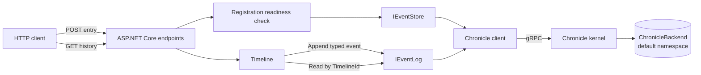

# Chronicle backend: append a fact, read its history

> A deliberately small ASP.NET Core sample that shows Chronicle's event-log fundamentals without adding an application framework or a read side.

**One event store. One default namespace. One typed event source. One immutable event.**

| Setting | Value |
| --- | --- |
| Event store | `ChronicleBackend` |
| Namespace | `EventStoreNamespaceName.Default` |
| Event source | `TimelineId` (`EventSourceId<Guid>`) |
| Event | `TimelineEntryRecorded` |
| API | ASP.NET Core minimal endpoints |

## What you will build

The API accepts a line of text for a timeline, appends a `TimelineEntryRecorded` event, and reads that timeline's event history directly from Chronicle.



The write and read paths use the same event log. There is no projection or mutable read model hiding the stored facts.

## Prerequisites

- The .NET SDK selected by the repository's `global.json` (the sample targets .NET 10).
- Docker Desktop or another Docker-compatible container runtime.
- Ports `35000` and `5095` available locally.
- A shell with `curl`.

The Chronicle development image uses development credentials and is intended only for local learning.

## Run the sample

Run every command from the repository root.

### 1. Start Chronicle

```bash
docker run --rm --name chronicle-backend-sample \
  -p 35000:35000 \
  cratis/chronicle:latest-development
```

Leave that terminal running. Chronicle serves its client endpoint and development workbench on port `35000`.

### 2. Restore and start the API

In a second terminal:

```bash
dotnet restore Chronicle/Backend/Backend.csproj
dotnet run --project Chronicle/Backend/Backend.csproj --no-restore --urls http://localhost:5095
```

The application uses Chronicle's development connection defaults, names the event store `ChronicleBackend`, and leaves namespace resolution on `EventStoreNamespaceName.Default`.

### 3. Inspect the sample metadata

```bash
curl --silent http://localhost:5095/
```

The response identifies the selected store, namespace, and endpoint templates.

## Append an event

Use a stable timeline identifier so the following history request addresses the same event source:

```bash
TIMELINE_ID=7d9d3f76-0c2d-4a93-a67b-d8f8fb2bc941

curl --include \
  --request POST \
  --header 'Content-Type: application/json' \
  --data '{"text":"Chronicle keeps the facts."}' \
  "http://localhost:5095/api/timelines/${TIMELINE_ID}/entries"
```

Expected response:

```http
HTTP/1.1 201 Created
Location: /api/timelines/7d9d3f76-0c2d-4a93-a67b-d8f8fb2bc941/history
Content-Type: application/json; charset=utf-8

{"timelineId":"7d9d3f76-0c2d-4a93-a67b-d8f8fb2bc941","sequenceNumber":0}
```

Chronicle owns the sequence number. A fresh event log starts at sequence number `0`; an existing local container can return a higher value.

An empty or whitespace-only `text` value returns HTTP `400` and is not appended.

## Read the event-source history

```bash
curl --silent \
  "http://localhost:5095/api/timelines/${TIMELINE_ID}/history"
```

Expected response shape (the server-assigned `occurred` value varies):

```json
[
  {
    "sequenceNumber": 0,
    "occurred": "2026-01-15T12:34:56.789Z",
    "text": "Chronicle keeps the facts."
  }
]
```

The history query filters the event log by the strongly typed `TimelineId` and the `TimelineEntryRecorded` event type. Events for another timeline do not appear.

## Registration-aware behavior

`UseCratisChronicle()` connects the client and starts automatic artifact discovery and registration. Before either data endpoint touches the event log, `ChronicleReadiness` awaits `WaitForRegistration()` for up to five seconds and checks the returned outcome.

- Registration completed successfully: the request proceeds.
- Registration did not finish before the deadline: the API returns HTTP `503`.
- Registration completed with a failure: the API returns HTTP `503` and directs you to the application and Chronicle logs.

This avoids treating a momentary connection flag as proof that registration finished. The registration outcome reports projection artifacts; this intentionally projection-free sample has none, but still waits for the registration round instead of racing startup.

## Run the specs

```bash
dotnet restore Chronicle/Backend/Backend.Specs/Backend.Specs.csproj
dotnet test Chronicle/Backend/Backend.Specs/Backend.Specs.csproj --no-restore
```

Expected summary:

```text
Passed!  - Failed: 0, Passed: 4, Skipped: 0, Total: 4
```

The specs verify that `Timeline`:

- appends `TimelineEntryRecorded` with the typed event-source identifier;
- returns Chronicle's append sequence number;
- queries history with the same typed identifier and event-type filter; and
- maps stored event content into the HTTP history shape.

## Build only

```bash
dotnet restore Chronicle/Backend/Backend.csproj
dotnet build Chronicle/Backend/Backend.csproj --no-restore
```

## Code tour

| File | Purpose |
| --- | --- |
| `Program.cs` | Configures the named Chronicle event store and ASP.NET Core pipeline. |
| `TimelineId.cs` | Gives the event source a domain-specific `EventSourceId<Guid>` identity. |
| `TimelineEntryRecorded.cs` | Defines the immutable, past-tense event. |
| `Timeline.cs` | Encapsulates direct event-log append and history operations. |
| `ChronicleReadiness.cs` | Turns registration completion or failure into explicit endpoint behavior. |
| `TimelineEndpoints.cs` | Exposes append, history, and sample metadata over HTTP. |
| `Backend.Specs/` | Specifies the Chronicle-facing behavior without external infrastructure. |

## Learning points

1. **Name the store at composition time.** `AddCratisChronicle()` selects `ChronicleBackend`; the default namespace resolver keeps the sample in one namespace.
2. **Type event-source identities.** `TimelineId` prevents unrelated `Guid` values from being used accidentally inside the Chronicle boundary.
3. **Write facts in past tense.** `TimelineEntryRecorded` describes something that happened and remains immutable.
4. **Use the event log directly when teaching the event log.** The append returns Chronicle's result, while history reads the stored events for one event source.
5. **Observe registration rather than guessing readiness.** Requests fail clearly with `503` instead of racing client startup.
6. **Keep the first sample focused.** Nothing obscures the relationship between HTTP, the Chronicle client, and the event log.

## Intentional limitations

This is a learning sample, not a production template.

- It has no authentication, authorization, rate limiting, maximum text length, or production secret/configuration handling.
- It does not apply optimistic concurrency or idempotency, so repeated POST requests append repeated facts.
- History is unpaged and reads directly from the event log; large histories need paging or a purpose-built read model.
- The specs isolate `Timeline` with `IEventLog`; they do not start Chronicle or exercise HTTP. The currently pinned in-process testing package does not provide a standalone runtime closure for this intentionally Arc-free sample.
- The sample does not include Arc, React, projections, tenancy, cross-store messaging, reactors, reducers, or deployment configuration.
- The development container and default connection settings are not production guidance.

Those omissions are deliberate. Add each concern only after you understand this append-and-history path.
