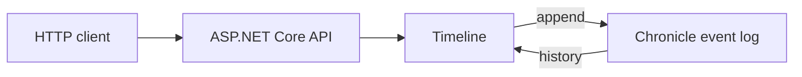

<div align="center">

# Chronicle Backend

### Append an immutable fact. Read the history. See the event log clearly.

**Chronicle · ASP.NET Core · Minimal APIs**

[Back to all samples](../../README.md)

</div>

---

## The idea

A timeline accepts short entries. Every entry becomes an immutable `TimelineEntryRecorded` event in Chronicle, and the API can read the complete history for one timeline.



There is no projection, database abstraction, frontend, or messaging layer in the way. This sample is about the event log itself.

## Run it

You need the .NET 10 SDK, Docker, and `curl`.

Start Chronicle:

```bash
docker run --rm --name chronicle-backend-sample \
  -p 35000:35000 \
  -p 8080:8080 \
  cratis/chronicle:latest-development
```

Start the API from the repository root:

```bash
dotnet run --project Chronicle/Backend/Backend.csproj --urls http://localhost:5095
```

The sample uses the `ChronicleBackend` event store and Chronicle's default namespace.

## Record something that happened

```bash
TIMELINE_ID=7d9d3f76-0c2d-4a93-a67b-d8f8fb2bc941

curl --request POST \
  --header 'Content-Type: application/json' \
  --data '{"text":"Chronicle keeps the facts."}' \
  "http://localhost:5095/api/timelines/${TIMELINE_ID}/entries"
```

The API responds with `201 Created` and Chronicle's sequence number for the appended event.

## Read the history

```bash
curl "http://localhost:5095/api/timelines/${TIMELINE_ID}/history"
```

You will get the entries recorded for that timeline in event-log order. Open Chronicle Workbench at <http://localhost:8080> and select `ChronicleBackend` to inspect the same history visually.

## Code tour

| File | What it shows |
| --- | --- |
| [`Program.cs`](./Program.cs) | The complete Chronicle and ASP.NET Core setup |
| [`TimelineId.cs`](./TimelineId.cs) | A strongly typed `EventSourceId<Guid>` identity |
| [`TimelineEntryText.cs`](./TimelineEntryText.cs) | A `ConceptAs<string>` domain value instead of a raw string |
| [`TimelineEntryRecorded.cs`](./TimelineEntryRecorded.cs) | A small, past-tense event built from that domain value |
| [`Timeline.cs`](./Timeline.cs) | Append and history operations against `IEventLog` |
| [`TimelineEndpoints.cs`](./TimelineEndpoints.cs) | Two focused HTTP endpoints |

The host setup is intentionally short:

```csharp
var builder = WebApplication.CreateBuilder(args)
    .AddCratisChronicle(options => options.EventStore = "ChronicleBackend");

var app = builder.Build();
app.UseCratisChronicle();
```

## Build and test

```bash
dotnet build Chronicle/Backend/Backend.csproj
dotnet test Chronicle/Backend/Backend.Specs/Backend.Specs.csproj
```

The small specification project checks the append and history behavior without requiring a running Chronicle container.

## Make it yours

- Add a second kind of timeline event.
- Return different history shapes for different questions.
- Move on to the Processing sample when you want projections, reducers, and reactions.

> [!NOTE]
> This focused sample deliberately leaves out Arc, React, projections, tenancy, cross-store messaging, authentication, and production configuration.
