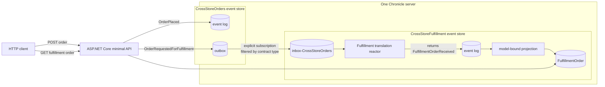

<div align="center">

# Chronicle cross-store flow

### Two bounded contexts. Two event stores. One Chronicle server

**Typed identities · Narrow contracts · Filtered outbox/inbox · Local translation**

</div>

---

This backend-only sample shows how one process can keep **Orders** and **Fulfillment** in separate named Chronicle event stores while connecting them with an explicit, filtered subscription.

Orders publishes a deliberately narrow contract to its outbox. Chronicle forwards that contract to Fulfillment's source-specific inbox. A Fulfillment reactor translates it into a target-owned event, and a target-owned projection materializes the local read model.

## Architecture



| Boundary | Owner | Stored fact |
| --- | --- | --- |
| Orders event log | Orders | `OrderPlaced` includes the source-owned buyer reference. |
| Orders outbox | Orders contract | `OrderRequestedForFulfillment` includes only SKU and quantity. |
| Fulfillment inbox | Chronicle subscription | The forwarded contract arrives on `inbox-CrossStoreOrders`. |
| Fulfillment event log | Fulfillment | `FulfillmentOrderReceived` uses target-owned value types. |
| Fulfillment read model | Fulfillment | `FulfillmentOrder` is projected only from the local event. |

The event source identity is not duplicated inside any event payload. Chronicle carries it in event context; Orders models it as `OrderId : EventSourceId<Guid>`, while Fulfillment owns `FulfillmentOrderId : EventSourceId<Guid>`.

## Delivery semantics: intentionally honest

This sample demonstrates asynchronous store integration, not a distributed transaction.

- Recording `OrderPlaced` and appending `OrderRequestedForFulfillment` are **two separate appends**. If outbox publication fails, the order fact remains recorded and the API reports that no rollback occurred.
- Outbox forwarding, inbox observation, local event append, and read-model projection complete asynchronously.
- The explicit subscription is registered idempotently at startup and is persisted by Chronicle, but consumers must still be designed for retries and possible duplicate delivery.
- Nothing here claims exactly-once delivery. Production code should add an explicit publication-recovery strategy and consumer idempotency appropriate to its domain.

Those boundaries are visible on purpose: a sample should not hide failure modes behind a synchronous-looking abstraction.

## Prerequisites

- The .NET SDK selected by the repository's `global.json` (the sample targets .NET 10).
- Docker Desktop or another Docker-compatible runtime.
- Ports `35000` and `5097` available locally.
- A shell with `curl`.

The projects use only versions from the repository's central package management.

## Run it

Run all commands from the Samples repository root.

### 1. Start one Chronicle development server

```bash
docker run --rm --name chronicle-cross-store-sample \
  -p 35000:35000 \
  cratis/chronicle:latest-development
```

That single server hosts both `CrossStoreOrders` and `CrossStoreFulfillment`.

### 2. Start the API

```bash
dotnet restore Chronicle/CrossStore/CrossStore.csproj
dotnet run \
  --project Chronicle/CrossStore/CrossStore.csproj \
  --no-restore \
  --urls http://localhost:5097
```

At startup, the application:

1. obtains both named stores from the same `IChronicleClient`;
2. registers `orders-for-fulfillment` on the target store; and
3. filters the subscription with `WithEventType<OrderRequestedForFulfillment>()`.

Inspect the configured flow:

```bash
curl --silent http://localhost:5097/ | jq
```

### 3. Place an order

Use a stable id so the read request addresses the corresponding target event source:

```bash
ORDER_ID=50d4f22e-c61e-40fb-8728-a88c2fc9326d

curl --include \
  --request POST \
  --header 'Content-Type: application/json' \
  --data '{"buyer":"buyer-1042","sku":"SKU-42","quantity":3}' \
  "http://localhost:5097/orders/${ORDER_ID}"
```

Expected shape:

```http
HTTP/1.1 202 Accepted
Location: /fulfillment/orders/50d4f22e-c61e-40fb-8728-a88c2fc9326d

{"orderId":"50d4f22e-c61e-40fb-8728-a88c2fc9326d","sourceEventStore":"CrossStoreOrders","targetEventStore":"CrossStoreFulfillment"}
```

`202 Accepted` is deliberate: the cross-store work continues asynchronously after the source appends complete.

### 4. Read Fulfillment's local view

```bash
curl --silent \
  "http://localhost:5097/fulfillment/orders/${ORDER_ID}" | jq
```

If materialization is still catching up, the endpoint returns `404`; retry the GET. Once complete, the response is shaped like:

```json
{
  "id": "50d4f22e-c61e-40fb-8728-a88c2fc9326d",
  "sku": "SKU-42",
  "quantity": 3
}
```

The GET does not query Orders and does not read the inbox contract directly. It returns a Fulfillment-owned projection of a Fulfillment-owned local event.

## Code tour

| File | Why it exists |
| --- | --- |
| `Program.cs` | Composes both stores, registers the filtered target subscription, and exposes the two HTTP operations. |
| `ApiModels.cs` | Keeps transport request and acceptance models in the sample namespace. |
| `StoreNames.cs` | Keeps store and subscription identities stable and obvious. |
| `OrderId.cs` | Defines distinct source and target `EventSourceId<Guid>` identities. |
| `DomainValues.cs` | Defines source, contract, and target `ConceptAs<T>` values rather than passing primitives through the model. |
| `Events.cs` | Places the private source fact, narrow contract fact, and target-owned local fact side by side for comparison. |
| `FulfillmentTranslationReactor.cs` | Observes only `inbox-CrossStoreOrders` and returns the local event to the target event log. |
| `FulfillmentOrder.cs` | Projects the local event into the target read model. |
| `CrossStore.Specs/` | Protects the contract boundary and the source-to-target translation with five focused assertions. |

## The important lines

The target creates an explicit subscription and forwards only one contract type:

```csharp
await fulfillmentStore.Subscriptions.Subscribe(
    StoreSubscriptionIds.OrdersForFulfillment,
    StoreNames.Orders,
    subscription => subscription.WithEventType<OrderRequestedForFulfillment>());
```

The producer publishes the contract to its outbox, not to the target store:

```csharp
await ordersStore
    .GetEventSequence(EventSequenceId.Outbox)
    .Append(orderId, new OrderRequestedForFulfillment(sku, quantity));
```

The target reactor is pinned to the source-specific inbox and returns a target-owned fact. Chronicle appends that returned fact to Fulfillment's event log:

```csharp
[EventSequence(EventSequenceId.InboxPrefix + StoreNames.Orders)]
public class FulfillmentTranslationReactor : IReactor
{
    public FulfillmentOrderReceived Requested(OrderRequestedForFulfillment @event) =>
        new(@event.Sku.Value, @event.Quantity.Value);
}
```

## Build and specs

The sample is intentionally not added to the root solution or manifests. Target it directly:

```bash
dotnet build Chronicle/CrossStore/CrossStore.csproj
dotnet test Chronicle/CrossStore/CrossStore.Specs/CrossStore.Specs.csproj
```

The specs stay small and useful:

- the public contract exposes only SKU and quantity, never the source-owned buyer reference;
- the reactor produces the target-owned event type; and
- translation crosses into target-owned `ConceptAs<T>` values.

## Ideas to try

1. **Add another outbox fact** and prove the existing filter does not forward it.
2. **Introduce publication recovery** for the gap between the source event-log append and outbox append.
3. **Make the target idempotent** by recording a processed-message identity before a non-repeatable side effect.
4. **Add a second consumer store** with a different contract filter and its own local translation.
5. **Observe failures** by making the reactor reject one contract, then inspect and recover the failed partition.
6. **Add correlation metadata** and trace the source append, forwarding, translation, and projection without coupling the stores.

## Intentional limitations

This is a focused learning sample, not a production template. It omits authentication, authorization, concurrency policies, schema migration, tenant routing, publication repair, operational dashboards, integration-container specs, and deployment configuration. Add those concerns deliberately without weakening the event-store ownership boundaries shown here.
