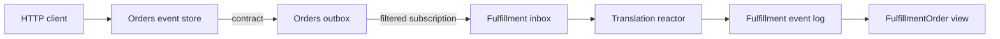

<div align="center">

# Chronicle Cross-Store

### Two bounded contexts. Two event stores. One explicit event flow.

**Chronicle · Outbox/inbox · Typed contracts · Local translation**

[Back to all samples](../../README.md)

</div>

---

## The idea

Orders and Fulfillment keep separate histories and separate vocabularies. Orders publishes one narrow contract through its outbox; Chronicle forwards it to Fulfillment's inbox, where a reactor translates it into a Fulfillment-owned event and read model.



| Boundary | Fact |
| --- | --- |
| Orders history | `OrderPlaced` |
| Shared contract | `OrderRequestedForFulfillment` |
| Fulfillment history | `FulfillmentOrderReceived` |
| Fulfillment view | `FulfillmentOrder` |

The contract carries only what Fulfillment needs. The buyer reference remains private to Orders.

## Run it

You need the .NET 10 SDK, Docker, and `curl`.

Start Chronicle:

```bash
docker run --rm --name chronicle-cross-store-sample \
  -p 35000:35000 \
  -p 8080:8080 \
  cratis/chronicle:latest-development
```

Start the API from the repository root:

```bash
dotnet run --project Chronicle/CrossStore/CrossStore.csproj --urls http://localhost:5097
```

The host creates the `CrossStoreOrders` and `CrossStoreFulfillment` stores and registers a subscription filtered to `OrderRequestedForFulfillment`.

## Place an order

```bash
ORDER_ID=50d4f22e-c61e-40fb-8728-a88c2fc9326d

curl --request POST \
  --header 'Content-Type: application/json' \
  --data '{"buyer":"buyer-1042","sku":"SKU-42","quantity":3}' \
  "http://localhost:5097/orders/${ORDER_ID}"
```

The endpoint responds with `202 Accepted` because the outbox, inbox, translation, and projection continue asynchronously.

Read Fulfillment's local view:

```bash
curl "http://localhost:5097/fulfillment/orders/${ORDER_ID}"
```

If processing is still catching up, retry the GET. You can also open Chronicle Workbench at <http://localhost:8080> and follow the same identifier through both stores.

## The important pieces

The source publishes a typed contract to its outbox:

```csharp
await ordersStore
    .GetEventSequence(EventSequenceId.Outbox)
    .Append(orderId, new OrderRequestedForFulfillment(sku, quantity));
```

The target subscribes to that exact contract type:

```csharp
await fulfillmentStore.Subscriptions.Subscribe(
    StoreSubscriptionIds.OrdersForFulfillment,
    StoreNames.Orders,
    subscription => subscription.WithEventType<OrderRequestedForFulfillment>());
```

The target reactor returns a local fact instead of leaking the external contract into its own model:

```csharp
public FulfillmentOrderReceived Requested(OrderRequestedForFulfillment @event) =>
    new(@event.Sku.Value, @event.Quantity.Value);
```

## Code tour

| File | What it shows |
| --- | --- |
| [`Program.cs`](./Program.cs) | Store composition, subscription, and two HTTP operations |
| [`DomainValues.cs`](./DomainValues.cs) | `ConceptAs<T>` values on both sides of the boundary |
| [`Events.cs`](./Events.cs) | Source fact, contract fact, and target fact |
| [`FulfillmentTranslationReactor.cs`](./FulfillmentTranslationReactor.cs) | Inbox-to-local-event translation |
| [`FulfillmentOrder.cs`](./FulfillmentOrder.cs) | Target-owned projected view |

## Build and test

```bash
dotnet build Chronicle/CrossStore/CrossStore.csproj
dotnet test Chronicle/CrossStore/CrossStore.Specs/CrossStore.Specs.csproj
```

## Make it yours

- Add another contract and give it a separate subscription filter.
- Make the target ignore a duplicate contract safely.
- Add a second consumer with its own local vocabulary.
- Introduce a failed translation and inspect the partition in Workbench.

> [!NOTE]
> Cross-store processing is asynchronous. The sample does not create a distributed transaction or claim exactly-once delivery. The two source appends are intentionally visible so you can decide what publication-recovery policy your application needs.
