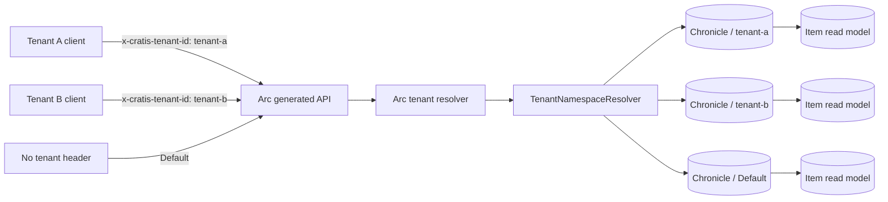

<div align="center">

# Tenant-scoped checklists

### One Arc API · one Chronicle store · one namespace per tenant

**Header tenancy · Model-bound CQRS · Typed event sources · MongoDB read models**

</div>

---

This backend-only sample shows the smallest useful Arc + Chronicle multi-tenant workflow: add a checklist item, then read its projected view. The same `ItemId` can exist in tenant A, tenant B, and `Default` without sharing events or read models.

## Architecture



`options.UseHeaderTenancy()` reads Arc's standard `x-cratis-tenant-id` header. Arc's Chronicle integration installs `TenantNamespaceResolver`, which maps the current tenant to a Chronicle namespace; an absent header and the explicit tenant name `Default` both select Chronicle's default namespace. The tenant id is therefore not duplicated on events.

## Run it

Prerequisites: the repository's .NET 10 SDK, Docker, and `curl`.

From the repository root, start the Chronicle development container. It exposes Chronicle on `35000` and its embedded MongoDB on `27017`:

```bash
docker run --rm --name chronicle-multitenancy-sample \
  -p 27017:27017 \
  -p 35000:35000 \
  cratis/chronicle:latest-development
```

In another terminal:

```bash
dotnet run --project Chronicle/MultiTenancy/MultiTenancy.csproj
```

The sample listens on `http://localhost:5097` through its launch profile.

## Try two tenants

Use one stable event-source identifier in every request:

```bash
ITEM_ID=6d88cc61-4b5a-4c29-a9cd-12d659b1671e
```

Add the item for tenant A:

```bash
curl --request POST http://localhost:5097/api/items/adding/add-item \
  --header 'Content-Type: application/json' \
  --header 'x-cratis-tenant-id: tenant-a' \
  --data "{\"itemId\":\"${ITEM_ID}\",\"text\":\"Prepare tenant A release\"}"
```

Add a different fact at the **same `ItemId`** for tenant B:

```bash
curl --request POST http://localhost:5097/api/items/adding/add-item \
  --header 'Content-Type: application/json' \
  --header 'x-cratis-tenant-id: tenant-b' \
  --data "{\"itemId\":\"${ITEM_ID}\",\"text\":\"Review tenant B metrics\"}"
```

Read each tenant's projected item through the model-bound query:

```bash
curl --get http://localhost:5097/api/items/listing/item-by-id \
  --header 'x-cratis-tenant-id: tenant-a' \
  --data-urlencode "id=${ITEM_ID}"

curl --get http://localhost:5097/api/items/listing/item-by-id \
  --header 'x-cratis-tenant-id: tenant-b' \
  --data-urlencode "id=${ITEM_ID}"
```

The first response contains `Prepare tenant A release`; the second contains `Review tenant B metrics`. Chronicle projections are asynchronous, so repeat a read if it races the first projection update.

To use the third isolation boundary, omit the header. This writes and reads the same identifier in `Default`:

```bash
curl --request POST http://localhost:5097/api/items/adding/add-item \
  --header 'Content-Type: application/json' \
  --data "{\"itemId\":\"${ITEM_ID}\",\"text\":\"Check the default workspace\"}"

curl --get http://localhost:5097/api/items/listing/item-by-id \
  --data-urlencode "id=${ITEM_ID}"
```

## Code tour

| File | Purpose |
| --- | --- |
| `Program.cs` | Selects Arc header tenancy, wires Arc to Chronicle, and configures tenant-aware MongoDB read models. |
| `Items/ItemId.cs` | Defines the stream identity as `EventSourceId<Guid>`. |
| `Items/ItemText.cs` | Defines the domain value as `ConceptAs<string>`. |
| `Items/Adding/Adding.cs` | Contains the model-bound `AddItem` command and immutable `ItemAdded` event. |
| `Items/Listing/Listing.cs` | Projects `ItemAdded` into the model-bound `Item` read model and exposes `ItemById`. |
| `MultiTenancy.Specs/` | Covers event construction, projection, and the same id in tenant A, tenant B, and `Default`. |

## Build and verify

The sample intentionally remains outside the shared solution; target its projects directly:

```bash
dotnet build Chronicle/MultiTenancy/MultiTenancy.csproj
dotnet test Chronicle/MultiTenancy/MultiTenancy.Specs/MultiTenancy.Specs.csproj
```

The focused namespace-isolation spec uses Chronicle's in-process event scenario, so the test suite needs no container.

## Ideas to try

- Send `x-cratis-tenant-id: Default` and confirm it addresses the same namespace as no header.
- Add an item that exists in only one tenant, then query that id from another tenant.
- Inspect MongoDB and compare the default read-model database with tenant-suffixed databases.
- Add a second event, such as `ItemCompleted`, and watch each tenant's projection evolve independently.

## Intentional limits

This is a learning sample, not a production tenancy policy. It has no authentication, tenant allow-list, authorization, idempotency, or production connection configuration. A caller that can choose any header can choose any namespace; real systems must derive or validate tenant access at a trusted boundary. There is no React client, cross-store messaging, or tenant id property on the event.
