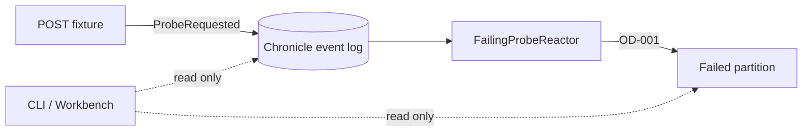

# Chronicle operations diagnosis

> One event. One reactor that falls over on purpose. Zero repair commands.

**A tiny local fixture for learning how to read a Chronicle failure before touching it.**

---

The sample appends a `ProbeRequested` event to a stable event source. `FailingProbeReactor` always throws `ProbeConfiguredToFail` with marker `OD-001`, leaving a failed observer partition that is easy to find with the current `cratis chronicle` CLI or Chronicle Workbench.



The domain is deliberately small: `ProbeId : EventSourceId<Guid>`, `ProbeName : ConceptAs<string>`, one event, and one reactor. Package references use the repository's centrally managed versions.

## Build and test

From the repository root:

```bash
dotnet build Chronicle/OperationsDiagnosis/OperationsDiagnosis.csproj
dotnet test Chronicle/OperationsDiagnosis/OperationsDiagnosis.Specs/OperationsDiagnosis.Specs.csproj
```

The sample is intentionally standalone and is not added to the root solution.

## Create the local symptom

Start the existing Chronicle development container:

```bash
docker compose -f Chronicle/Quickstart/docker-compose.yml up -d chronicle
```

Run the fixture API:

```bash
dotnet run --project Chronicle/OperationsDiagnosis/OperationsDiagnosis.csproj
```

In another terminal, append the one deliberate failure event:

```bash
curl --request POST http://localhost:5078/fixture/failure
```

The response names the store, namespace, event type, expected exception, and stable event source:

```text
00000000-0000-0000-0000-00000000d1a6
```

This POST is fixture setup and does mutate the local event log. Everything below is diagnosis and is read-only.

## Read-only CLI runbook

The installed CLI catalog is the versioned authority. If your CLI differs, check it before continuing:

```bash
cratis llm-context
cratis chronicle --help
```

Pin every command to the local server and fixture store so there is no context ambiguity:

```bash
SERVER=chronicle://localhost:35000
STORE=OperationsDiagnosisSample
NAMESPACE=Default
SOURCE=00000000-0000-0000-0000-00000000d1a6
```

### 1. Orient

```bash
cratis chronicle event-stores list --server "$SERVER" -o plain
cratis chronicle namespaces list --server "$SERVER" -e "$STORE" -o plain
cratis chronicle diagnose --server "$SERVER" -e "$STORE" -n "$NAMESPACE" -o plain
```

Expected signal: the store is reachable and reports a failed partition. `diagnose --watch --interval 2` is also read-only; press Ctrl+C once the failure appears.

### 2. Find the observer and failed partition

```bash
cratis chronicle observers list --server "$SERVER" -e "$STORE" -n "$NAMESPACE" --type reactor -o plain
cratis chronicle failed-partitions list --server "$SERVER" -e "$STORE" -n "$NAMESPACE" -o plain
```

Copy the `FailingProbeReactor` observer id from the output, then inspect both sides of the failure:

```bash
cratis chronicle observers show <OBSERVER_ID> --server "$SERVER" -e "$STORE" -n "$NAMESPACE" -o json
cratis chronicle failed-partitions show <OBSERVER_ID> "$SOURCE" --server "$SERVER" -e "$STORE" -n "$NAMESPACE" --detailed -o json
```

Expected signal: the partition key is the stable source id and the detailed error contains `ProbeConfiguredToFail` and `OD-001`.

### 3. Prove the input exists

```bash
cratis chronicle events get --server "$SERVER" -e "$STORE" -n "$NAMESPACE" --event-source-id "$SOURCE" -o json
cratis chronicle event-types show ProbeRequested --server "$SERVER" -e "$STORE" -n "$NAMESPACE" -o json
```

Diagnosis is complete when the event is present, the reactor is registered, and the failed partition explains the stable `OD-001` exception. Stop there.

## Chronicle Workbench: forensics mode

Open the live terminal workbench against the same explicit target:

```bash
cratis chronicle workbench --server "$SERVER" -e "$STORE" -n "$NAMESPACE" --interval 2
```

Use the read-only path:

1. **Overview** (`1`) — confirm the failure count.
2. **Observers** (`2`) — select `FailingProbeReactor` and inspect its details.
3. **Failures** (`3`) — select the stable partition and read the exception.
4. **Event Sequences** (`6`) — filter for `ProbeRequested` or the source id.

Useful controls are arrow keys, `F` to filter, `Esc` to clear a filter, `?` for help, `Ctrl+C` to copy detail, and `Q` to quit. The Workbench also exposes operational actions; do not invoke them during this runbook.

## Safety boundary

This diagnosis flow does **not** replay an observer, retry a partition, clear quarantine, remove data, redact events, perform recommendations, manage users or applications, or pass `--yes`. Those are separate operations requiring an understood cause, an approved target, and an explicit recovery plan.

A failed partition is evidence. Read it before changing it.
