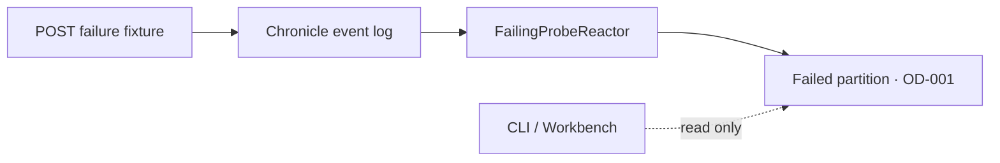

<div align="center">

# Chronicle Operations Diagnosis

### Create one known failure. Find it. Understand it. Stop before repair.

**Chronicle · CLI · Workbench · Failed partitions**

[Back to all samples](../../README.md)

</div>

---

## The idea

The sample appends one `ProbeRequested` event. `FailingProbeReactor` deliberately throws an exception marked `OD-001`, giving you a predictable failed partition to inspect.



The model stays tiny: `ProbeId : EventSourceId<Guid>`, `ProbeName : ConceptAs<string>`, one event, and one reactor.

## Prerequisites

- .NET 10 SDK
- Docker with Compose support
- `curl`
- A Cratis CLI version supporting the Chronicle commands shown below

## Run it

Start the existing Chronicle development container:

```bash
docker compose -f Chronicle/Quickstart/docker-compose.yml up -d chronicle
```

Start the fixture API:

```bash
dotnet run --project Chronicle/OperationsDiagnosis/OperationsDiagnosis.csproj
```

Create the known failure:

```bash
curl --request POST http://localhost:5078/fixture/failure
```

The stable event source is:

```text
00000000-0000-0000-0000-00000000d1a6
```

## Find it with the CLI

Pin the target so every command is unambiguous:

```bash
SERVER=chronicle://localhost:35000
STORE=OperationsDiagnosisSample
NAMESPACE=Default
SOURCE=00000000-0000-0000-0000-00000000d1a6
```

Start broad:

```bash
cratis chronicle diagnose --server "$SERVER" -e "$STORE" -n "$NAMESPACE" -o plain
cratis chronicle observers list --server "$SERVER" -e "$STORE" -n "$NAMESPACE" --type reactor -o plain
cratis chronicle failed-partitions list --server "$SERVER" -e "$STORE" -n "$NAMESPACE" -o plain
```

Copy the `FailingProbeReactor` observer id, then inspect the partition:

```bash
cratis chronicle failed-partitions show \
  <OBSERVER_ID> "$SOURCE" \
  --server "$SERVER" -e "$STORE" -n "$NAMESPACE" \
  --detailed -o json
```

The error contains `ProbeConfiguredToFail` and marker `OD-001`. Confirm the input event is present:

```bash
cratis chronicle events get \
  --server "$SERVER" -e "$STORE" -n "$NAMESPACE" \
  --event-source-id "$SOURCE" -o json
```

## Open Workbench

```bash
cratis chronicle workbench \
  --server "$SERVER" -e "$STORE" -n "$NAMESPACE" --interval 2
```

Use **Overview**, **Observers**, **Failures**, and **Event Sequences** to follow the same failure visually.

## Code tour

| File | What it shows |
| --- | --- |
| [`Program.cs`](./Program.cs) | Chronicle setup and the fixture endpoint |
| [`ProbeId.cs`](./ProbeId.cs) | Stable typed event-source identity |
| [`ProbeName.cs`](./ProbeName.cs) | `ConceptAs<string>` domain value |
| [`Events.cs`](./Events.cs) | The input fact |
| [`FailingProbeReactor.cs`](./FailingProbeReactor.cs) | A deterministic observer failure |

## Build and test

```bash
dotnet build Chronicle/OperationsDiagnosis/OperationsDiagnosis.csproj
dotnet test Chronicle/OperationsDiagnosis/OperationsDiagnosis.Specs/OperationsDiagnosis.Specs.csproj
```

## Make it yours—safely

- Compare `plain` and `json` output from the diagnosis commands.
- Match the observer id shown by `observers list` with the failed partition details.
- Change the local fixture marker and identity, then repeat the same read-only inspection.

> [!IMPORTANT]
> The POST creates local fixture data. The diagnosis flow is read-only: do not replay, retry, clear quarantine, redact events, or run administrative actions as part of this sample.
