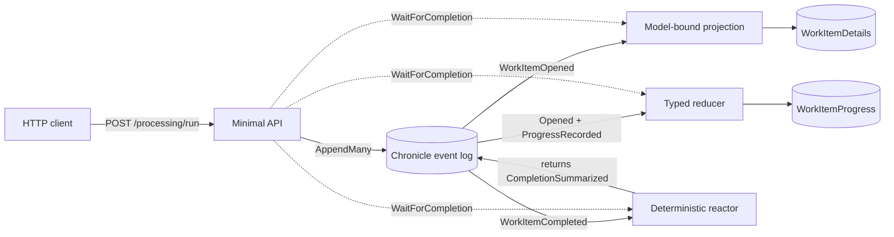

<div align="center">

# Chronicle focused processing

### One event stream. Three processing styles. No sleeps.

**Model-bound projection · Typed reducer · Deterministic reactor · ASP.NET Core**

</div>

---

This backend-only sample keeps Chronicle processing small and visible. One HTTP request appends a work item's history, waits for the affected observers, and returns the resulting views and reactor output.

## Architecture



| Style | Artifact | What it shows |
| --- | --- | --- |
| Model-bound projection | `WorkItemDetails` | `[FromEvent<T>]` and AutoMap for a direct event-to-view mapping. |
| Typed reducer | `WorkItemProgressReducer` | Prior-state accumulation, coordinated calculations, and immutable `with` transitions. |
| Deterministic reactor | `CompletionSummaryReactor` | A stateless follow-up event derived only from the triggering event. |

The domain uses `WorkItemId : EventSourceId<Guid>` for stream identity and small `ConceptAs<T>` values for titles, work points, and completion summaries. This keeps events and read models strongly typed without distracting from the processing flow.

## Prerequisites

- .NET 10 SDK, selected by the repository's `global.json`.
- Docker with Compose support.
- The existing Chronicle development container, which provides the local kernel and read-model sink.

The projects use only package versions managed centrally by this repository.

## Run it

From the repository root, start Chronicle:

```bash
docker compose -f Chronicle/Quickstart/docker-compose.yml up -d chronicle
```

Start the sample API:

```bash
dotnet run --project Chronicle/Processing/Processing.csproj
```

Then trigger the flow:

```bash
curl --request POST http://localhost:5074/processing/run
```

The response contains a generated work item id and these results:

```json
{
  "details": {
    "title": "Publish the focused processing sample",
    "plannedPoints": 8
  },
  "progress": {
    "completedPoints": 8,
    "remainingPoints": 0
  },
  "reactorOutput": {
    "summary": "Completed 8 of 8 planned points and met the plan.",
    "metPlan": true
  },
  "waitedForProcessing": true
}
```

The endpoint uses `WaitForCompletion` with a ten-second deadline before reading materialized state. It does not use `Thread.Sleep`, `Task.Delay`, or timing guesses.

## Build and test

The sample is intentionally not added to the root solution. Target its projects directly:

```bash
dotnet build Chronicle/Processing/Processing.csproj
dotnet test Chronicle/Processing/Processing.Specs/Processing.Specs.csproj
```

The three focused specifications show the projection binding, reducer fold, and deterministic reactor result without introducing external infrastructure.

## Learning points

- Use `EventSourceId<T>` for stream identities and `ConceptAs<T>` for meaningful domain values.
- Start with model-bound attributes when event and view properties line up.
- Choose a reducer when the next state genuinely depends on prior state.
- Keep reactors stateless; use event data directly and return follow-up events instead of injecting `IEventLog`.
- Await an observable processing boundary when a request truly needs read-after-write consistency.

## Limitations

- **Materialization is asynchronous.** An append can be durable before projections and reducers catch up. This endpoint waits because it immediately reads both views; most write paths should remain asynchronous.
- The ten-second deadline is a sample choice, not a production service objective.
- The request appends fixed demonstration data. It does not cover commands, validation, authorization, or user input.
- The default Chronicle development connection is local-only.
- There is no Arc, React, tenancy, cross-store flow, or frontend.
