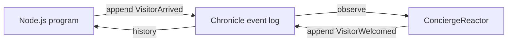

<div align="center">

# Chronicle TypeScript Client

### Append a fact from Node.js. Let a reactor respond. Read the combined history.

**Chronicle · Node.js · TypeScript**

[Back to all samples](../../README.md)

</div>

---

## The idea

A guestbook records visitors. The program appends one immutable `VisitorArrived` event, a reactor responds by appending a `VisitorWelcomed` event, and the program reads the complete history back — all from Node.js with the [`@cratis/chronicle`](https://www.npmjs.com/package/@cratis/chronicle) client.



There is no HTTP API, projection, or frontend in the way. This sample is about the TypeScript client and the event log itself.

## Pinned versions

| Piece | Version |
| --- | --- |
| [`@cratis/chronicle`](https://www.npmjs.com/package/@cratis/chronicle) | `3.1.1` |
| [`@cratis/fundamentals`](https://www.npmjs.com/package/@cratis/fundamentals) | `7.18.2` |
| Chronicle server image | `cratis/chronicle:latest-development` |
| Node.js | 23 or newer |

The npm dependencies are pinned exactly in [`package.json`](./package.json). The `latest-development` image tag is a moving development tag; the sample intentionally tracks the current development build of the Chronicle server.

## Run it

You need Node.js 23 or newer, npm, and Docker.

Start Chronicle with the included [`docker-compose.yml`](./docker-compose.yml) — the development image bundles MongoDB, so one container is enough:

```bash
cd Chronicle/TypeScript
docker compose up -d
```

Install the dependencies and run the sample:

```bash
npm install
npm start
```

You should see the three steps in order:

```text
[append] VisitorArrived('Ada') appended to 'reception-guestbook' at sequence 0.
[react]  ConciergeReactor saw VisitorArrived('Ada') at sequence 0 and responds with a VisitorWelcomed event.
[read]   Guestbook 'reception-guestbook' history — 2 event(s):
  [seq 0] VisitorArrived: {"name":"Ada"}
  [seq 1] VisitorWelcomed: {"name":"Ada","greeting":"Welcome, Ada!"}
```

Pass a name to record someone else — every run appends new facts to the same history:

```bash
npm start -- Grace
```

Open Chronicle Workbench at <http://localhost:8080> and select the `TypeScriptGuestbook` event store to inspect the same history visually.

## Clean up

Stop and remove the container when you are done:

```bash
docker compose down
```

The event store lives inside the container, so removing it also removes the recorded history. Remove the sample's local artifacts with:

```bash
npm run clean
```

## Code tour

| File | What it shows |
| --- | --- |
| [`events.ts`](./events.ts) | Two small, past-tense `@eventType()` classes |
| [`reactor.ts`](./reactor.ts) | A `@reactor()` that returns a side-effect event |
| [`index.ts`](./index.ts) | Connect, append, wait for observers, and read the history |
| [`docker-compose.yml`](./docker-compose.yml) | The single-container local Chronicle server |

The client setup is intentionally short:

```typescript
const client = new ChronicleClient(ChronicleOptions.development());
const store = await client.getEventStore('TypeScriptGuestbook');
const result = await store.eventLog.append(GUESTBOOK_ID, new VisitorArrived(name));
```

After the append, `result.waitForCompletion()` waits until every observer — here the `ConciergeReactor` — has caught up, so the read that follows sees the reactor's side effect instead of racing it.

Set the `CHRONICLE_CONNECTION` environment variable to point the sample at a different Chronicle server (for example `chronicle://localhost:35000`).

## Build check

```bash
npm run compile
```

Type-checks the sample with the TypeScript compiler.

## Make it yours

- Record a `VisitorLeft` event and react to it differently.
- Give `VisitorWelcomed` its own event source to build a separate welcome log.
- Move on to the [Chronicle Backend](../Backend/README.md) sample to see the same append-and-read journey from .NET behind an HTTP API.

> [!NOTE]
> This focused sample deliberately leaves out projections, read models, constraints, transactions, tenancy, authentication, and production configuration.
