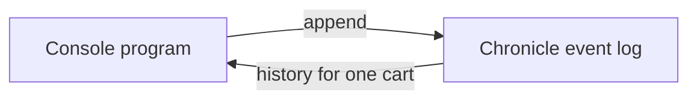

<div align="center">

# Step 01 — First events

### Define events, append them to the event log, and read them back

**Chronicle · .NET console**

[Learning path](../README.md) · Next: [Step 02 — First projection](../02-FirstProjection/README.md)

</div>

---

## The idea

In an event-sourced system you don't store the current state of a shopping cart. You store what happened to it: an item was added, an item was removed, the cart was checked out. Each of those facts is an **event**, and Chronicle keeps them in order in the **event log**, forever.



All events about one cart share the cart's identity, its **event source id**. Reading the events for that id gives you the cart's full history.

New to event sourcing? Read [What is event sourcing?](https://www.cratis.io/concepts/event-sourcing/) first, or alongside this step.

## Run it

Start Chronicle as described in the [learning path README](../README.md#before-you-start), then run the step from the repository root:

```bash
dotnet run --project LearningPath/01-FirstEvents/FirstEvents.csproj
```

You will see something like this, with your own cart id and times:

```text
Appended 4 events for cart 1c0afda3-91a6-4604-8f9b-886c68583773.

#0 at 14:02:11: ItemAddedToCart { Product = Coffee beans, Quantity = 2 }
#1 at 14:02:11: ItemAddedToCart { Product = Oat milk, Quantity = 1 }
#2 at 14:02:11: ItemRemovedFromCart { Product = Oat milk, Quantity = 1 }
#3 at 14:02:11: CartCheckedOut { }
```

The number in front of each event is its sequence number in the event log. Every run creates a new cart, so the sequence numbers keep growing. Open Chronicle Workbench at <https://localhost:35000>, pick the `LearningPathFirstEvents` event store, and look at the event sequence to see the same events.

## Code tour

| File | What it shows |
| --- | --- |
| [`Events.cs`](./Events.cs) | Three events, each a small past-tense record marked `[EventType]` |
| [`CartId.cs`](./CartId.cs) | The cart's identity, an `EventSourceId<Guid>`, so the compiler knows a cart id from any other `Guid` |
| [`ProductName.cs`](./ProductName.cs), [`Quantity.cs`](./Quantity.cs) | Domain values as `ConceptAs<T>` types instead of raw strings and numbers |
| [`Program.cs`](./Program.cs) | Connect, append, and read the history back |

The heart of the step is two calls on the event log:

```csharp
var appendResult = await eventStore.EventLog.AppendMany(
    cartId,
    [
        new ItemAddedToCart("Coffee beans", 2),
        new ItemAddedToCart("Oat milk", 1),
        new ItemRemovedFromCart("Oat milk", 1),
        new CartCheckedOut()
    ]);

var history = await eventStore.EventLog.GetFromSequenceNumber(EventSequenceNumber.First, cartId);
```

Notice what the events don't contain: the cart id. The event source id travels alongside each event, not inside it. And notice what's missing entirely: there is no cart table, and nothing ever updates or deletes a row.

## Make it yours

- Add a `CartAbandoned` event and append it instead of `CartCheckedOut`.
- Append to the same cart twice by giving it a fixed id instead of `CartId.New()`.
- Work out the number of items in the cart by looping over the history. That loop is what a projection does for you in the next step.

## Next

[Step 02 — First projection](../02-FirstProjection/README.md) turns these events into a read model you can query.

## Questions? Ask on Discord

Ask questions and get help from the Cratis team and other developers on the [Cratis Discord](https://discord.gg/kt4AMpV8WV).
