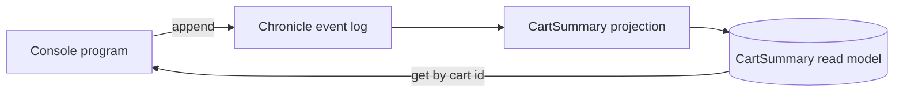

<div align="center">

# Step 02 — First projection

### Build a read model from events and query it

**Chronicle · .NET console**

Previous: [Step 01 — First events](../01-FirstEvents/README.md) · [Learning path](../README.md) · Next: [Step 03 — Commands and queries](../03-CommandsAndQueries/README.md)

</div>

---

## The idea

The event log answers "what happened?". Most screens ask "what is true now?": how many items are in this cart, and has it been checked out? A **projection** answers that question by folding a cart's events into a **read model**, and Chronicle keeps that read model up to date as new events arrive.



You never write code that updates the read model. You declare which event changes which property, and Chronicle does the rest. If you later need a different view, you add another projection and Chronicle builds it from the events you already have.

Read [Projections and read models](https://www.cratis.io/concepts/projections-and-read-models/) for the ideas behind this step.

## Run it

Start Chronicle as described in the [learning path README](../README.md#before-you-start), then run the step from the repository root:

```bash
dotnet run --project LearningPath/02-FirstProjection/FirstProjection.csproj
```

You will see the read model before and after the cart is checked out:

```text
Cart ba9b382e-740f-46ac-92a6-e27038e51f2a holds 6 items. Checked out: False.
Cart ba9b382e-740f-46ac-92a6-e27038e51f2a holds 6 items. Checked out: True.
```

Two coffee bean bags, plus one oat milk, minus that oat milk, plus four cinnamon buns: six items.

## Code tour

| File | What it shows |
| --- | --- |
| [`CartSummary.cs`](./CartSummary.cs) | The read model, with the projection declared as attributes on its properties |
| [`Program.cs`](./Program.cs) | Append events, wait for the projection to catch up, and read the read model |
| [`Events.cs`](./Events.cs), [`CartId.cs`](./CartId.cs), [`ProductName.cs`](./ProductName.cs), [`Quantity.cs`](./Quantity.cs) | The same cart types as step 01 |

The projection is the read model itself:

```csharp
public record CartSummary(
    CartId Id,

    [AddFrom<ItemAddedToCart>(nameof(ItemAddedToCart.Quantity))]
    [SubtractFrom<ItemRemovedFromCart>(nameof(ItemRemovedFromCart.Quantity))]
    int ItemCount,

    [SetValue<CartCheckedOut>(true)]
    bool CheckedOut);
```

Read the attributes as sentences: adding an item adds its quantity to `ItemCount`, removing one subtracts it, and checking out sets `CheckedOut` to `true`. Chronicle keys each `CartSummary` by the cart's event source id. The client finds the projection when it connects; there is nothing to register.

Projections run in the background, so a read straight after an append can miss the newest events. This step reads its own write, so it waits for the projection first:

```csharp
var completion = await appendResult.WaitForCompletion(TimeSpan.FromSeconds(10));
var cart = await eventStore.ReadModels.GetInstanceById<CartSummary>((EventSourceId)cartId);
```

Most reads don't need to wait. Waiting is for the occasional caller that must see what it just wrote.

## Make it yours

- Add a `ProductCount` property with `[Increment<ItemAddedToCart>]` and `[Decrement<ItemRemovedFromCart>]`, and see how it differs from `ItemCount`.
- Call `eventStore.ReadModels.GetInstances<CartSummary>()` to list every cart you have created.
- Open Workbench at <https://localhost:35000> and find the `CartSummary` projection in the `LearningPathFirstProjection` event store.

## Next

[Step 03 — Commands and queries](../03-CommandsAndQueries/README.md) puts an HTTP API in front of the same events and read model with Arc.

## Questions? Ask on Discord

Ask questions and get help from the Cratis team and other developers on the [Cratis Discord](https://discord.gg/kt4AMpV8WV).
