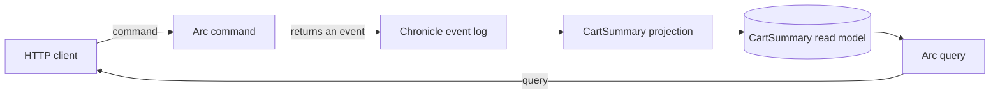

<div align="center">

# Step 03 — Commands and queries with Arc

### Append events from a command and return the read model from a query

**Arc · Chronicle · ASP.NET Core**

Previous: [Step 02 — First projection](../02-FirstProjection/README.md) · [Learning path](../README.md)

</div>

---

## The idea

So far a console program appended events and read them back. A real application takes requests from users. This step splits those requests into two kinds, the core idea of **CQRS**:

- A **command** asks the system to do something. Here, each command decides which event happened and Arc appends it to Chronicle.
- A **query** asks what is true now. Here, the query returns the `CartSummary` read model that the projection from step 02 keeps up to date.



Arc turns the command records and the query method into HTTP endpoints. There are no controllers to write.

Read [CQRS explained](https://www.cratis.io/concepts/cqrs/) for the ideas behind this step.

## Run it

Start Chronicle as described in the [learning path README](../README.md#before-you-start), then start the API from the repository root:

```bash
dotnet run --project LearningPath/03-CommandsAndQueries/CommandsAndQueries.csproj
```

The API listens on <http://localhost:5103> and uses the `LearningPathCommandsAndQueries` event store.

## Send commands

Pick a cart id and add two items:

```bash
CART_ID=7d9d3f76-0c2d-4a93-a67b-d8f8fb2bc941

curl --request POST \
  --header 'Content-Type: application/json' \
  --data "{\"cartId\":\"${CART_ID}\",\"product\":\"Coffee beans\",\"quantity\":2}" \
  http://localhost:5103/api/carts/add-item-to-cart

curl --request POST \
  --header 'Content-Type: application/json' \
  --data "{\"cartId\":\"${CART_ID}\",\"product\":\"Oat milk\",\"quantity\":1}" \
  http://localhost:5103/api/carts/add-item-to-cart
```

Each command answers with a command result. `"isSuccess":true` means Arc appended the event.

## Query the cart

```bash
curl "http://localhost:5103/api/carts/by-id?id=${CART_ID}"
```

The `data` part of the query result is the read model:

```json
{"id":"7d9d3f76-0c2d-4a93-a67b-d8f8fb2bc941","itemCount":3,"checkedOut":false}
```

The projection runs in the background, so a query sent immediately after a command can return the state from just before it. Ask again and it has caught up.

Now remove an item and check out:

```bash
curl --request POST \
  --header 'Content-Type: application/json' \
  --data "{\"cartId\":\"${CART_ID}\",\"product\":\"Oat milk\",\"quantity\":1}" \
  http://localhost:5103/api/carts/remove-item-from-cart

curl --request POST \
  --header 'Content-Type: application/json' \
  --data "{\"cartId\":\"${CART_ID}\"}" \
  http://localhost:5103/api/carts/check-out-cart

curl "http://localhost:5103/api/carts/by-id?id=${CART_ID}"
```

The cart now holds two items and is checked out.

## Code tour

| File | What it shows |
| --- | --- |
| [`Program.cs`](./Program.cs) | The whole host: `AddCratis()` and `UseCratis()` wire up Arc and the Chronicle client |
| [`AddItemToCart.cs`](./AddItemToCart.cs), [`RemoveItemFromCart.cs`](./RemoveItemFromCart.cs), [`CheckOutCart.cs`](./CheckOutCart.cs) | Commands: `[Command]` records whose `Handle()` returns the event that happened |
| [`CartSummary.cs`](./CartSummary.cs) | The step 02 read model, now marked `[ReadModel]` with a static `ById` query |
| [`appsettings.json`](./appsettings.json) | The event store name, the Chronicle connection, and how routes are built |
| [`Events.cs`](./Events.cs), [`CartId.cs`](./CartId.cs), [`ProductName.cs`](./ProductName.cs), [`Quantity.cs`](./Quantity.cs) | The same cart types as the earlier steps |

A command is a record with a `Handle()` method:

```csharp
[Command]
public record AddItemToCart(CartId CartId, ProductName Product, Quantity Quantity)
{
    public ItemAddedToCart Handle() => new(Product, Quantity);
}
```

`Handle()` doesn't write anything. It returns the event, and Arc appends it to the event source named by the command's `CartId`, because `CartId` is an `EventSourceId`.

A query is a static method on the read model. Arc resolves its parameters: `id` comes from the query string, and `IReadModels` comes from dependency injection:

```csharp
public static Task<CartSummary> ById(CartId id, IReadModels readModels) =>
    readModels.GetInstanceById<CartSummary>((EventSourceId)id);
```

Routes come from the namespace and the type or method name. The types live in `LearningPath.CommandsAndQueries.Carts`; `appsettings.json` skips the first two namespace segments, so the routes start with `/api/carts/`.

## Make it yours

- Add a `ListAll` query that returns `readModels.GetInstances<CartSummary>()`.
- Add a `CommandValidator<AddItemToCart>` that rejects a quantity of zero, and see the validation result in the command response.
- Add an `EmptyCart` command and a matching event, then teach `CartSummary` what it means.

## Next

This is the last step so far. Later steps will cover reactors, changing events over time, testing, and production. The [Capstone](../../Capstone/README.md) sample shows the same command and query shape with a React frontend.

## Questions? Ask on Discord

Ask questions and get help from the Cratis team and other developers on the [Cratis Discord](https://discord.gg/kt4AMpV8WV).
