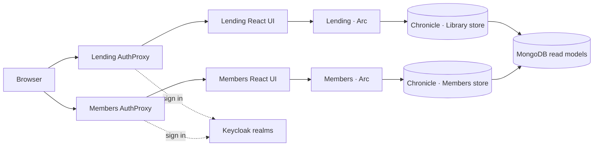

# Library showcase

A small, end-to-end library system for exploring how a Cratis application fits together: React frontends, Arc-generated APIs and TypeScript proxies, Chronicle events and projections, MongoDB read models, and Cratis Components.

## What you can explore

The sample presents two focused applications behind local authentication:

| Application | What it looks like |
| --- | --- |
| **Lending** | A desktop-style workspace with a sidebar, paged **Authors** and **Books** tables, and Cratis command dialogs for registering an author or adding a book title. |
| **Members** | A compact **My Library** portal with cards for currently borrowed books and a profile page for the signed-in member. |

The initial event seed supplies recognizable authors, books, members, reservations, and borrowings. PrimeReact supplies tables and cards, while `@cratis/components` and Arc React provide the command forms, dialogs, and generated command/query hooks.

## Run it with Aspire and MongoDB

From the repository root, install the frontend workspaces once, then start the Library AppHost:

```shell
yarn install
cd Library
./run-mongodb.sh
```

Keep Docker (or a compatible container runtime) running. The repository pins the .NET SDK and Yarn toolchain used by the sample.

The Aspire dashboard opens automatically. When all resources are healthy, use these local endpoints:

| Resource | URL |
| --- | --- |
| Aspire dashboard | <http://localhost:15888> |
| Lending application | <http://localhost:7000> |
| Members application | <http://localhost:7001> |
| Chronicle Workbench | <http://localhost:8080> |

The AppHost starts MongoDB, Chronicle, Vault, two Keycloak realms, both ASP.NET Core backends, both Vite development servers, and the AuthProxy entry points. The credentials below are local sample data only:

| Application | Username | Password |
| --- | --- | --- |
| Lending | `librarian` | `librarian` |
| Lending | `borrower` | `borrower` |
| Members | `alice` | `alice` |
| Members | `bob` | `bob` |

Stop the AppHost with `Ctrl+C`.

## Architecture



- **React + Cratis Components** render commands, observable queries, tables, dialogs, and member-facing cards.
- **Arc** discovers model-bound commands and queries, exposes their HTTP endpoints, and generates the colocated TypeScript proxies consumed by React.
- **Chronicle** stores domain events and runs projections and reducers into MongoDB read models.
- **Aspire Composition** wires infrastructure, authentication, applications, endpoints, startup order, and observability into one local run.
- **Lending.Contracts** holds the borrowing integration events shared by the two application domains.

## Project map

```text
Library/
├── Composition/        Aspire AppHost and local Keycloak realm imports
├── Lending/            Librarian UI, authors, inventory, lending behavior, and specs
├── Lending.Contracts/  Borrowing integration event contracts
├── Members/            Member portal, identity, profiles, and borrowed-book views
├── Library.slnx        Application solution
└── run-mongodb.sh      Recommended local entry point
```

Backend and frontend files live together by behavior rather than in separate technical trees. For example:

```text
Lending/Authors/
├── AuthorId.cs
├── AuthorName.cs
├── Registration/
│   ├── Registration.cs       command, event, and uniqueness constraint
│   ├── RegisterAuthor.ts     generated Arc command proxy
│   ├── AddAuthor.tsx         Cratis Components command dialog
│   └── when_registering/     command specifications
└── Listing/
    ├── Listing.cs            read model, observable query, and projection
    ├── ObserveAll.ts         generated Arc query proxy
    ├── Listing.tsx           paged React table
    └── for_author_projection/ projection specifications
```

Concept types make domain intent visible at every boundary: `AuthorName` is a `ConceptAs<string>`, `ISBN` is an `EventSourceId`, and identifiers such as `AuthorId` and `MemberId` are dedicated types rather than loose primitives. A Debug build regenerates the TypeScript commands, queries, and models used by each React slice.

## Build and verify

From the Samples repository root:

```bash
dotnet build Library/Library.slnx --configuration Debug
dotnet test Library/Library.slnx --configuration Debug --no-build
dotnet build Library/Library.slnx --configuration Release -p:CratisProxiesOutputPath=
yarn --cwd Library/Lending build
yarn --cwd Library/Members build
```

## Ideas to try

- Register an author, then add a book and select that author in the generated command form.
- Keep the Authors or Books table open while changing data and observe the query update.
- Open Chronicle Workbench and follow `AuthorRegistered` or `BookAddedToInventory` from event to projection.
- Compare `Registration.cs`, its generated `RegisterAuthor.ts` proxy, and `AddAuthor.tsx` to see the full-stack type flow.
- Follow book availability through the lending reducers, then inspect the borrowing event contracts on each side.
- Run the colocated specifications from this directory with `dotnet test Library.slnx`.
