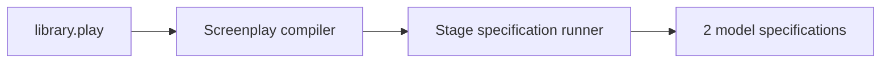

<div align="center">

# Model-First Library

### Write the behavior once. Compile it. Run the specifications.

**Screenplay · Stage · Commands · Events · Model specifications**

[Back to all samples](../../README.md)

</div>

---

## The idea

[`library.play`](./library.play) describes one small catalog workflow as a software model:

```text
AddBook command
    │
    ├── validates title and author
    │
    ▼
BookAddedToCatalog event
```

The same file contains one accepted example and one rejected example. Screenplay compiles the model; Stage runs those examples as model-level specifications.



## What is in the model

- `BookId`, `BookTitle`, and `AuthorName` concepts;
- an `AddBook` state-change slice;
- required title and author rules;
- the `BookAddedToCatalog` fact;
- one successful scenario;
- one expected validation rejection.

Open [`library.play`](./library.play) before running anything—the complete behavior fits on one screen.

## Run it

This sample uses already-built local Screenplay and Stage checkouts. With the standard Cratis sibling-repository layout, run these commands from this directory:

```bash
export SCREENPLAY_REPO=${SCREENPLAY_REPO:-../../../Screenplay}
export STAGE_REPO=${STAGE_REPO:-../../../Stage}

# Compile the model and treat warnings as errors.
dotnet run --no-build --no-restore \
  --project "$SCREENPLAY_REPO/Source/DotNET/Tool/Tool.csproj" -- \
  "$PWD/library.play" --warnaserror

# Run the specifications embedded in the model.
RESULTS_PATH="${TMPDIR:-/tmp}/cratis-library-stage-results.json"
dotnet run --no-build --no-restore \
  --project "$STAGE_REPO/Source/SpecRunner/SpecRunner.csproj" -- \
  --model "$PWD" --output "$RESULTS_PATH"

cat "$RESULTS_PATH"
```

The current model compiles without diagnostics and produces two passing specification results.

## Make it yours

- Add an ISBN concept and require it on `AddBook`.
- Add a second rejection for an empty author name.
- Introduce a read model after exploring the focused state-change slice.
- Change an expected event value and watch the specification catch it.

> [!NOTE]
> This is the first bounded model-first step. It verifies compilation and model specifications; it does not yet demonstrate a live Chronicle command, query results, Scene UI, complete source generation, or a Studio round trip.
